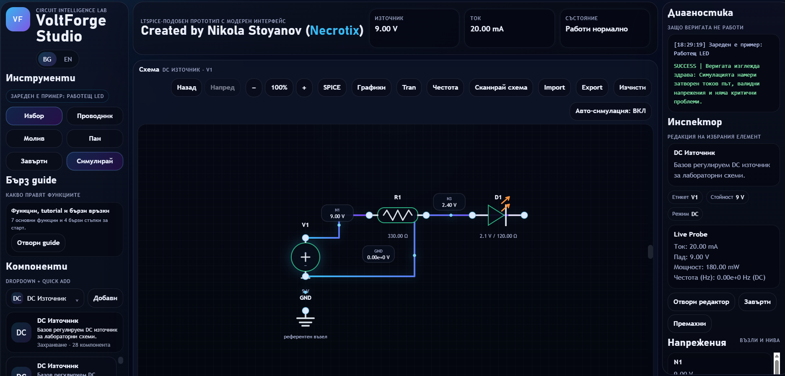
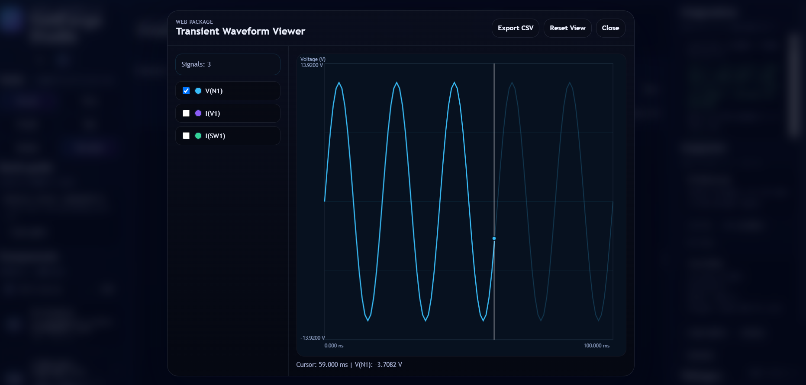
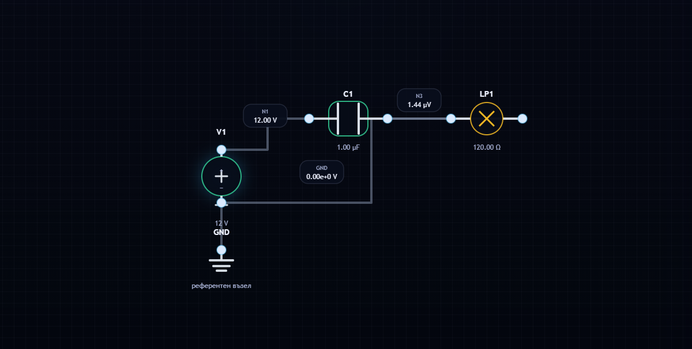

# VoltForge Studio

[](LICENSE)
[](#project-status)
[](CONTRIBUTING.md)
[](https://github.com/drnecrotix/volt-forge-stodio/actions/workflows/ci.yml)
[](https://github.com/drnecrotix/volt-forge-stodio/actions/workflows/release.yml)
[](https://github.com/drnecrotix/volt-forge-stodio/commits/main)

**Design. Simulate. Analyze.**

VoltForge Studio is an open-source circuit design environment for visually building, simulating, and analyzing electronic circuits with SPICE. The project aims to provide an approachable workspace for both web and desktop users, combining schematic editing, project persistence, netlist generation, simulation, and waveform analysis.

## Overview

The goal of VoltForge Studio is to make circuit exploration feel direct and visual without hiding the underlying engineering workflow. It is designed for students, hobbyists, educators, and engineers who want to move smoothly from a schematic to simulation results.

## Project Preview

### Visual circuit workspace

Build and inspect circuits in a focused workspace with component controls, live measurements, simulation status, and an editable schematic canvas.



### Transient waveform viewer

Explore simulated signals, select individual traces, inspect cursor values, reset the viewport, and export waveform data as CSV.



### Circuit schematic and live node values

View a clean schematic representation with component labels, values, node voltages, and a clearly defined ground reference.



## Features and Focus

Implemented and active areas of development include:

- Visual schematic editing and component placement
- Wire connections and editable component values
- JSON-based project save, load, import, and export
- Ngspice-compatible netlist generation
- SPICE simulation workflows
- Transient waveform visualization and CSV export
- Consistent project compatibility across web and desktop experiences
- Accessible, maintainable, and modular user interfaces

## Technology and Project Tracks

VoltForge Studio is being shaped around two complementary tracks:

### Desktop application

- Python 3.10+
- PySide6 for the desktop interface
- Ngspice as the simulation backend
- Optional PyQtGraph-based waveform visualization

### Web application

- HTML, CSS, and JavaScript
- Browser-based schematic workspace
- Client-side project persistence and netlist generation
- Modular simulation and waveform-viewer components

The implementation is still evolving. Technical choices and repository structure may change before the first stable release.

## Project Status

VoltForge Studio is in early development. The repository includes the Python desktop MVP, browser application, reusable web modules, tests, example circuits, and user/developer documentation. Interfaces and technical choices may change before the first stable release.

## Getting Started

### Prerequisites

- Git
- Python 3.10 or newer
- Ngspice installed and available from your system `PATH`

Confirm the required tools before continuing:

```bash
git --version
python --version
ngspice --version
```

On systems where Python 3 is exposed as `python3`, use `python3` in place of `python` throughout these instructions.

### Clone the Repository

```bash
git clone https://github.com/drnecrotix/volt-forge-stodio.git
cd volt-forge-stodio
```

### Create a Virtual Environment

Windows PowerShell:

```powershell
python -m venv .venv
.\.venv\Scripts\Activate.ps1
```

macOS and Linux:

```bash
python3 -m venv .venv
source .venv/bin/activate
```

### Install the Desktop Application

Upgrade the packaging tools, then install VoltForge Studio in editable mode with waveform plotting support:

```bash
python -m pip install --upgrade pip
python -m pip install -e ".[plot]"
```

### Run the Desktop Application

```bash
python -m opencircuitlab.main
```

After installation, the package entry point is also available:

```bash
opencircuitlab
```

If Python cannot find `opencircuitlab`, confirm that the virtual environment is active and repeat `python -m pip install -e .` from the repository root.

### Run the Tests

```bash
python -m unittest discover -s tests
```

### Web Application

The web prototype has no package dependencies or build step. Start a local static server from the repository root:

```bash
python -m http.server 8000
```

Then open <http://localhost:8000> in a modern browser. Avoid opening `index.html` directly from the filesystem because browser security rules can interfere with module loading and import/export features.

## Repository Layout

```text
.
├── src/opencircuitlab/   # Python desktop application
├── tests/                # Python unit tests
├── examples/             # Example circuit projects
├── docs/                 # User/developer guides and screenshots
├── webapp/               # Reusable browser modules
├── app.js                # Main browser application
├── index.html            # Web entry point
├── styles.css            # Web interface styles
└── pyproject.toml        # Python package and dependency configuration
```

## Releases

Release builds are automated with GitHub Actions. Pushing a version tag such as `v0.1.0` will:

1. install the project and run the unit tests;
2. build both the source distribution and Python wheel;
3. validate the distributions with Twine;
4. upload the build output as a workflow artifact;
5. create a GitHub Release with generated release notes and attach the built packages.

The release workflow can also be started manually from GitHub Actions to verify that a package build succeeds without creating a GitHub Release.

Watch the [releases page](https://github.com/drnecrotix/volt-forge-stodio/releases) and [changelog](CHANGELOG.md) for availability updates.

## Roadmap

Development is organized into public milestones covering the first source release, SPICE simulation workflows, schematic editing, the web track, and broader analysis support. See [ROADMAP.md](ROADMAP.md) for the current direction.

## Support

For usage questions, bug-report guidance, feature requests, and project support expectations, read [SUPPORT.md](SUPPORT.md). Security vulnerabilities should be reported privately according to [SECURITY.md](SECURITY.md).

## Contributing

Ideas, bug reports, feature requests, documentation improvements, and code contributions are welcome. Before contributing:

1. Read [CONTRIBUTING.md](CONTRIBUTING.md).
2. Follow the [Code of Conduct](CODE_OF_CONDUCT.md).
3. Use the provided issue or pull request template.

Please report security vulnerabilities privately according to [SECURITY.md](SECURITY.md).

## License

VoltForge Studio is open-source software released under the [MIT License](LICENSE).

## Contact

- Project: <https://github.com/drnecrotix/volt-forge-stodio>
- Maintainer: [@drnecrotix](https://github.com/drnecrotix)
